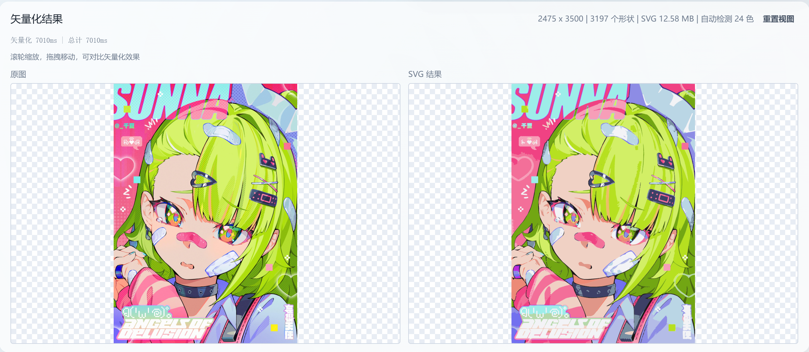

# neroued_vectorizer

高质量栅格到矢量（raster-to-SVG）C++ 库，将位图自动转换为平滑的多色 SVG。

## 效果展示



## 特性

- 7 阶段流水线：预处理 → 颜色分割 → 边界提取 → 轮廓装配 → 曲线拟合 → 轮廓追踪 → SVG 输出
- 基于 Potrace 的位图追踪，Clipper2 拓扑修复
- SLIC 超像素 + K-Means 自动调色板
- Schneider 贝塞尔曲线拟合，亚像素边界细化
- 薄线增强、抗锯齿边缘检测
- 可选 ICC 色彩管理（lcms2）
- 质量评估模块（PSNR / SSIM / Delta E / Chamfer 距离）
- CLI 工具：`raster_to_svg`、`evaluate_svg`
- Python 绑定：`pip install neroued-vectorizer`

## 依赖

| 依赖 | 版本 | 说明 |
|------|------|------|
| OpenCV | >= 4.5 | core, imgproc, imgcodecs |
| Potrace | - | 系统库 `libpotrace-dev` |
| spdlog | >= 1.14 | 自动通过 FetchContent 获取 |
| Clipper2 | >= 2.0 | 自动通过 FetchContent 获取 |
| nanosvg | - | vendored，SVG 解析（eval/tests 使用） |
| lcms2 | - | 可选，ICC 色彩管理 |
| libjpeg | - | 可选，配合 lcms2 |
| OpenMP | - | 可选，并行加速 |

### 系统依赖安装

**Ubuntu / Debian:**

```bash
sudo apt install libopencv-dev libpotrace-dev liblcms2-dev libjpeg-dev
```

**macOS (Homebrew):**

```bash
brew install opencv potrace little-cms2 jpeg
```

## 构建

```bash
mkdir build && cd build
cmake .. -DCMAKE_BUILD_TYPE=Release
cmake --build . -j$(nproc)
```

### 构建选项

| 选项 | 默认值 | 说明 |
|------|--------|------|
| `NV_BUILD_EVAL` | ON | 构建质量评估库 |
| `NV_BUILD_APPS` | ON | 构建 CLI 工具 |
| `NV_BUILD_TESTS` | ON | 构建单元测试 |
| `NV_BUILD_PYTHON` | OFF | 构建 Python 绑定（需要 pybind11） |

仅构建核心库：

```bash
cmake .. -DNV_BUILD_EVAL=OFF -DNV_BUILD_APPS=OFF -DNV_BUILD_TESTS=OFF
```

### 安装

```bash
cmake --install build --prefix /usr/local
```

安装内容包括：头文件、静态库（`libneroued_vectorizer.a`、`libneroued_vectorizer_eval.a`）、CLI 工具。

## CLI 工具

### raster_to_svg

将栅格图像转换为 SVG：

```bash
./build/apps/raster_to_svg --image input.png --out output.svg
```

常用参数：

| 参数 | 默认值 | 说明 |
|------|--------|------|
| `--image` | 必需 | 输入图像路径 |
| `--out` | 同目录 .svg | 输出 SVG 路径 |
| `--colors` | 0 | 量化颜色数（0 = 自动） |
| `--smoothness` | 0.5 | 轮廓平滑度 [0,1] |
| `--detail-level` | -1 | 统一细节控制 [0,1]（-1 = 禁用） |
| `--curve-fit-error` | 0.8 | 曲线拟合误差阈值 |
| `--min-region` | 50 | 最小区域面积（像素²） |
| `--upscale-short-edge` | 600 | 短边自动放大阈值 |
| `--log-level` | info | 日志级别 |

完整参数列表可通过 `--help` 查看。

### evaluate_svg

评估矢量化质量：

```bash
# 单图评估
./build/apps/evaluate_svg --image input.png --json report.json

# 批量评估
./build/apps/evaluate_svg --manifest manifest.json --baseline-dir baselines/
```

常用参数：

| 参数 | 说明 |
|------|------|
| `--image FILE` | 单图模式，输入图像路径 |
| `--manifest FILE` | 批量模式，Manifest JSON 路径 |
| `--svg-dir DIR` | SVG 输出目录 |
| `--json FILE` | 指标/报告输出 JSON 路径 |
| `--baseline-dir DIR` | 基线目录，用于回归对比 |
| `--set-baseline` | 保存当前结果为新基线 |
| `--history FILE` | CSV 历史文件，追加运行摘要 |
| `--category CAT` | 仅运行指定类别的图像（批量模式） |
| `--note TEXT` | 注释，存入历史/报告 |
| `--log-level LEVEL` | 日志级别（默认 info） |

矢量化参数覆盖（与 `raster_to_svg` 相同）可通过 `--help` 查看。

## Python 绑定

### 安装

```bash
pip install neroued-vectorizer
```

从源码构建（需要系统已安装 OpenCV 和 Potrace）：

```bash
pip install .
```

### Python 用法

```python
import neroued_vectorizer as nv

# 从文件路径
result = nv.vectorize("photo.png")

# 从内存字节
with open("photo.png", "rb") as f:
    result = nv.vectorize(f.read())

# 从 numpy 数组（BGR/BGRA/GRAY uint8）
import numpy as np
img = np.zeros((100, 100, 3), dtype=np.uint8)
result = nv.vectorize(img)

# 自定义配置
config = nv.VectorizerConfig()
config.num_colors = 8
config.curve_fit_error = 1.0
result = nv.vectorize("photo.png", config)

# 使用结果
print(result.svg_content)       # SVG 文档字符串
print(result.width, result.height)
print(result.num_shapes)
print(result.palette)           # list[nv.Rgb]

# 保存
result.save("output.svg")
```

`VectorizerConfig` 的所有参数与 C++ 版本一致，参见下方参数表。

## 库集成

### CMake add_subdirectory

```cmake
add_subdirectory(path/to/neroued_vectorizer EXCLUDE_FROM_ALL)
target_link_libraries(your_target PRIVATE neroued::vectorizer)
```

### CMake FetchContent

```cmake
include(FetchContent)
FetchContent_Declare(neroued_vectorizer
    GIT_REPOSITORY https://github.com/neroued/neroued_vectorizer.git
    GIT_TAG master)
FetchContent_MakeAvailable(neroued_vectorizer)
target_link_libraries(your_target PRIVATE neroued::vectorizer)
```

## API

```cpp
#include <neroued/vectorizer/vectorizer.h>

using namespace neroued::vectorizer;

// 从文件路径
VectorizerConfig config;
config.num_colors = 8;
auto result = Vectorize("input.png", config);

// 从内存缓冲区（ICC 感知）
auto result = Vectorize(data_ptr, data_size, config);

// 从 cv::Mat
cv::Mat image = cv::imread("input.png");
auto result = Vectorize(image, config);

// 使用结果
std::cout << "SVG shapes: " << result.num_shapes << "\n";
std::cout << "Palette: " << result.palette.size() << " colors\n";
std::ofstream("output.svg") << result.svg_content;
```

### VectorizerConfig 完整参数

| 参数 | 类型 | 默认值 | 说明 |
|------|------|--------|------|
| **颜色分割** | | | |
| `num_colors` | int | 0 | 调色板颜色数，0 = 自动检测 |
| `min_region_area` | int | 50 | 最小区域面积（像素²） |
| **曲线拟合** | | | |
| `curve_fit_error` | float | 0.8 | Schneider 曲线拟合误差阈值 |
| `corner_angle_threshold` | float | 135.0 | 角点检测角度阈值（度） |
| `smoothness` | float | 0.5 | 轮廓平滑度 [0,1] |
| **预处理** | | | |
| `smoothing_spatial` | float | 15.0 | Mean Shift 空间窗口半径 |
| `smoothing_color` | float | 25.0 | Mean Shift 颜色窗口半径 |
| `upscale_short_edge` | int | 600 | 短边自动放大阈值（0 = 禁用） |
| `max_working_pixels` | int | 3000000 | 自动缩小像素阈值（0 = 禁用） |
| **SLIC 分割** | | | |
| `slic_region_size` | int | 20 | SLIC 目标区域大小 |
| `slic_compactness` | float | 6.0 | SLIC 紧致度 |
| `edge_sensitivity` | float | 0.8 | 边缘感知空间权重衰减 [0,1] |
| `refine_passes` | int | 6 | 边界标签细化迭代次数 |
| `max_merge_color_dist` | float | 200.0 | 小区域合并最大 LAB ΔE² |
| **亚像素边界** | | | |
| `enable_subpixel_refine` | bool | true | 启用梯度引导亚像素细化 |
| `subpixel_max_displacement` | float | 0.7 | 亚像素最大法向位移 |
| **抗锯齿检测** | | | |
| `enable_antialias_detect` | bool | false | 启用 AA 混合边缘检测 |
| `aa_tolerance` | float | 10.0 | AA 混合像素最大 LAB ΔE |
| **薄线增强** | | | |
| `thin_line_max_radius` | float | 2.5 | 距离变换半径阈值 |
| **SVG 输出** | | | |
| `svg_enable_stroke` | bool | true | 启用描边输出 |
| `svg_stroke_width` | float | 0.5 | 描边宽度 |
| **细节控制** | | | |
| `detail_level` | float | -1.0 | 统一细节控制 [0,1]（-1 = 禁用） |
| `merge_segment_tolerance` | float | 0.05 | 近线性贝塞尔段合并容差 |
| **Potrace 管线** | | | |
| `min_contour_area` | float | 10.0 | 最小轮廓面积 |
| `min_hole_area` | float | 4.0 | 最小孔洞面积 |
| `contour_simplify` | float | 0.45 | 轮廓简化强度 |
| `enable_coverage_fix` | bool | true | 启用覆盖率补全 |
| `min_coverage_ratio` | float | 0.998 | 触发补全的最低覆盖率 |

### VectorizerResult

| 字段 / 方法 | 类型 | 说明 |
|------|------|------|
| `svg_content` | string | 完整 SVG 文档 |
| `width` | int | 图像宽度（像素） |
| `height` | int | 图像高度（像素） |
| `num_shapes` | int | SVG 中的形状数 |
| `resolved_num_colors` | int | 实际使用的颜色数 |
| `palette` | vector\<Rgb\> / list[Rgb] | 使用的调色板 |
| `save(path)` | Python only | 将 SVG 内容保存到文件 |

## 目录结构

```
neroued_vectorizer/
├── include/neroued/vectorizer/   # 公共头文件
│   ├── vectorizer.h              # 主 API
│   ├── config.h                  # VectorizerConfig
│   ├── result.h                  # VectorizerResult
│   ├── color.h                   # 颜色类型（Rgb, Lab）
│   ├── vec2.h / vec3.h           # 向量类型
│   ├── error.h                   # 错误类型
│   └── logging.h                 # 日志初始化
├── src/                          # 内部实现（按管线阶段组织）
│   ├── preprocess/               # 预处理（缩放、Mean Shift）
│   ├── segment/                  # 颜色分割（SLIC、K-Means、形态学）
│   ├── boundary/                 # 边界提取（图构建、亚像素、AA检测）
│   ├── contour/                  # 轮廓装配（链式装配、薄线）
│   ├── curve/                    # 曲线拟合（贝塞尔、Schneider）
│   ├── trace/                    # 追踪（Potrace、覆盖率、拓扑修复）
│   ├── output/                   # 输出（SVG 写入、形状合并）
│   └── detail/                   # 内部工具（cv_utils、icc_utils）
├── python/                       # Python 绑定
│   ├── neroued_vectorizer/       # Python 包（__init__.py、类型桩）
│   ├── bindings.cpp              # pybind11 绑定代码
│   └── tests/                    # Python 测试
├── eval/                         # 质量评估库
├── apps/                         # CLI 工具
├── ci/                           # CI 依赖安装脚本
└── tests/                        # 单元测试
```

## 版本管理与发布

版本号由 git tag 自动派生（基于 [setuptools-scm](https://github.com/pypa/setuptools-scm)）：

- `v0.2.0` tag → PyPI 版本 `0.2.0`
- tag 后的开发提交 → `0.2.1.dev3+gabcdef`

### 发布流程

```bash
# 1. 预发布验证（自动发到 TestPyPI）
git tag v0.2.0rc1
git push origin v0.2.0rc1

# 2. 验证 TestPyPI 上的包
pip install --index-url https://test.pypi.org/simple/ \
            --extra-index-url https://pypi.org/simple/ \
            neroued-vectorizer==0.2.0rc1

# 3. 正式发布（自动发到 PyPI）
git tag v0.2.0
git push origin v0.2.0
```

### 支持平台

| 平台 | 架构 | Python |
|------|------|--------|
| Linux | x86_64, aarch64 | 3.10 – 3.13 |
| macOS | x86_64, arm64 | 3.10 – 3.13 |
| Windows | x86_64 | 3.10 – 3.13 |

## 许可证

本项目使用 [GPL-3.0-or-later](LICENSE) 许可证。
