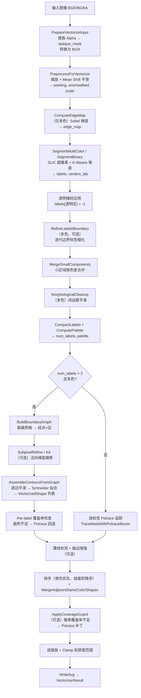

# V1 管线架构深度诊断

## 1. 管线总览

### 1.1 流程图

### 1.2 代码规模

| 模块 | 目录 | 行数 | 职责 |
|------|------|------|------|
| 预处理 | `src/preprocess/` | 121 | 缩放、Mean Shift 平滑 |
| 颜色分割 | `src/segment/` | 1,258 | SLIC 超像素、K-Means 聚类、形态学清理、小区域合并 |
| 边界提取 | `src/boundary/` | 915 | 裂缝网格边界图、亚像素细化、AA 检测 |
| 轮廓装配 | `src/contour/` | 865 | 链式轮廓装配、薄线矢量化 |
| 曲线拟合 | `src/curve/` | 703 | 贝塞尔工具、Schneider 拟合 |
| Potrace 追踪 | `src/trace/` | 852 | Potrace 封装、覆盖率修补、拓扑修复 |
| SVG 输出 | `src/output/` | 369 | SVG 生成、同色形状合并 |
| 内部工具 | `src/detail/` | 459 | OpenCV 辅助、ICC 色彩管理 |
| 管线编排 | `src/pipeline.cpp` + `vectorizer.cpp` | 563 | 管线编排、公共 API 入口 |
| 公共头文件 | `include/neroued/vectorizer/` | 641 | 配置、结果、颜色类型、向量类型 |
| **总计** | | **6,782** | |

**复杂度集中区域**：`segment/`（1,258 行）、`boundary/`（915 行）、`contour/`（865 行）三个模块合计 3,038 行，占总代码量 45%。这三个模块正是 V1 的核心——"分割 → 边界图 → 轮廓装配"管线，也是问题最多的部分。

---

## 2. 逐阶段分析

### 2.1 预处理（`src/preprocess/preprocess.cpp`，121 行）

**算法**：
- 条件降采样：`max_working_pixels` 控制上限，`INTER_AREA` 缩放
- 条件升采样：`upscale_short_edge` 控制小图放大，最多 4x
- Mean Shift 颜色平滑：`cv::pyrMeanShiftFiltering(bgr, filtered, sp, sr)`

**已知问题**：
- Mean Shift 平滑是全局的，会模糊重要的细节边缘
- 平滑后的图用于 SLIC，未平滑的图用于边缘/细化——两套图数据不一致可能导致分割与细化之间的语义偏差
- 小图自适应逻辑硬编码阈值（`short_edge <= 128`）

**评估**：该模块本身实现简洁合理，可在 V2 中完全复用。

### 2.2 颜色分割（`src/segment/`，1,258 行）

#### SLIC 超像素（`slic.cpp`，471 行）

**算法**：
- 网格初始化种子 → 梯度引导微扰 → 迭代距离更新
- 距离 = `||color_diff||² + λ·||spatial_diff||²`，`λ = (compactness/step)²`
- 若有 edge_map，`spatial_lambda *= max(0.1, 1 - edge_sensitivity * edge)`
- `EnforceConnectivity`：四邻域直方图投票合并小块（与颜色无关）

**已知问题**：
- SLIC 产出的超像素块可能跨越真实边界（特别是在弱梯度区域）
- `EnforceConnectivity` 按邻域投票而非颜色相似度合并，可能将异色小块合并到错误区域
- 超像素数少于目标颜色数时，整个 SLIC 被跳过，退化为全局像素 K-Means——完全失去空间正则

#### K-Means 聚类（`color_segment.cpp`，621 行）

**算法**：
- 正常路径：对 SLIC 超像素中心在 LAB 空间做 K-Means → 每个像素标签 = `km_labels[slic_label[pixel]]`
- 回退路径：超像素不足时对全图像素直接 K-Means

**已知问题**：
- K-Means 只在颜色空间聚类，完全不考虑空间连续性
- 色差用 LAB 欧氏距离而非 CIEDE2000，对蓝色系等区域感知不准确
- `EstimateOptimalColors` 是启发式的（网格抽样 + proxy 图），在色彩连续变化的场景下表现不稳定

#### 后处理（`morphology.cpp`，80 行）

- `MergeSmallComponents`：3 轮迭代，4-连通，按 LAB 距离合并小区域
- `MorphologicalCleanup`：按面积从大到小对每标签做闭运算
- `CompactLabels`：重映射标签

**已知问题**：
- 闭运算按面积从大到小进行，大区域可能吞并细结构
- 合并判据 `max_merge_color_dist` 是 LAB ΔE²，阈值不够感知化

### 2.3 边界提取（`src/boundary/`，915 行）

#### 裂缝网格（`boundary_graph.cpp`，384 行）

**算法**：
- 扫描 labels 图，相邻像素标签不同处在 crack 网格上加边
- 2×2 角点处多条裂缝汇聚的点为 junction（交汇点）
- 从 junction 出发沿同一标签对走边链

**已知问题**：
- **边界完全锁定在像素网格**（axis-aligned 阶梯），这是所有后续平滑和拟合的起点
- **交汇点（junction）位置固定不可移动**，即使子像素细化也无法调整
- 拓扑一旦建立就不可更改——如果分割有误，边界图无法补救

#### 子像素细化（`subpixel_refine.cpp`，281 行）

**算法**：
- 对每条边的内部点（首尾 junction 固定），沿法向在未平滑 LAB 上采样
- 找一维梯度剖面的最大峰，抛物插值细化位置
- 平移量 clamp 到 `max_displacement`

**已知问题**：
- **只做一维法向搜索**，在急转折处法向估计不准
- 端点固定意味着 junction 附近的边界始终不准
- 平坦区/纹理区可能产生伪峰

#### AA 检测（`aa_detector.cpp`，130 行）

- 检测边界像素是否为两中心的线性混合 → 用 alpha 偏移调整
- 假设过强：非线性混合、三色交界、渐变区域不适用

### 2.4 轮廓装配（`src/contour/assembly.cpp`，628 行）

**算法**：
1. 逐边平滑：`DecimateNearCollinear` + `SmoothOpenChain`
2. 逐边 Schneider 拟合：`FitBezierToPolyline` → 贝塞尔段序列
3. 按标签遍历环，拼接贝塞尔链 → 闭合轮廓
4. 符号面积区分外轮廓 / 孔洞 → `VectorizedShape`

**已知问题**：
- `ChainEdgeRefsIntoLoops` 在多出边节点取"第一条未用边"——贪心策略在复杂交汇处容易链错
- 平滑和拟合共享同一份边数据（两侧标签看到相同几何），但如果某一侧的最优曲线与另一侧不一致，没有机制协调
- 孔洞判定依赖 `original_signed_area` 与包含关系混合，边界数据异常时分类可能出错
- 存在死代码：`ChainEdgesIntoLoops`、`PointsToBezierContour`、`ReverseBezierChain` 等函数在当前仓库无调用

### 2.5 曲线拟合（`src/curve/fitting.cpp`，523 行）

**算法**：经典 Schneider 递归
- 弦长参数化 → 固定端点和切向 → 最小二乘解 `p1/p2`
- 若最大偏离超阈值 → Newton 重参数化 → 仍超差则中点分裂递归
- 深度达 `max_recursion_depth` 退化为线性段

**已知问题**：
- 递归深度限制导致高曲率或噪声区域产生大量线性退化段
- 没有全局后优化（拟合完成后不再尝试减少控制点数）
- `FitBezierOnGraph` 与装配路径内联拟合功能重叠

### 2.6 Potrace 追踪（`src/trace/potrace.cpp`，430 行）

**算法**：
- `TraceMaskWithPotraceBezier`：保留 Potrace 原生三次段 → `BezierContour`
- 嵌套处理：`sign == '+'` + `childlist` 组外+孔结构

**使用场景**：
- 多色标签 > 2 时：主路径覆盖不足的标签回退
- 双色/少标签时：作为主追踪器
- CoverageGuard 修补时：再次调用

**已知问题**：
- 与边界图 + Schneider 拟合**能力重叠**——三重矢量化机制共存
- Potrace 回退追踪整个标签 mask，不知道边界图已经覆盖了哪些部分 → 可能产生重叠形状

### 2.7 覆盖率修补（`src/trace/coverage.cpp`，205 行）

**算法**：
- 将现有 shapes 栅格化 → coverage 图
- 若 `covered/source < min_ratio`：找 missing 区域连通块 → 每块用 Potrace 追踪 → 追加形状
- 补丁与已有 coverage 重叠 > 50% 则丢弃

**已知问题**：
- 栅格化近似（展平容差 0.45、整像素 fillPoly）引入误差
- 补丁标签用连通块内众数 label，边界混合区可能偏色
- 补丁会**增加形状数量**和文件尺寸

### 2.8 SVG 输出（`src/output/svg_writer.cpp`，202 行）

**算法**：
- 每个 `VectorizedShape` → 一个 `<path>`
- 多轮廓（含孔）用 `fill-rule="evenodd"`，孔反向写 `C` 段
- 数值精度：2 位小数去尾零

**已知问题**：
- 无 `<g>` 分组、无 `<defs>` 复用、无结构优化
- 孔洞反向写法增加路径复杂度

### 2.9 形状合并（`src/output/shape_merge.cpp`，83 行）

**算法**：
- 连续同色（ΔE76 < 3）形状，若新形 bbox 与 run 内已有 bbox **不重叠**，则合并

**已知问题**：
- bbox 不重叠条件过于保守：空间上分离但绘制顺序安全的同色形状不会被合并
- 合并后 `area` 字段只保留第一个，不累加

---

## 3. 与 Adobe Illustrator Image Trace 的能力差距

| 能力维度 | Adobe Illustrator | V1 管线 | 差距评估 |
|----------|-------------------|---------|----------|
| 矢量化模型 | 逐色层独立追踪 + 画家算法叠放 | 全局边界图共享边 + 三重修补 | **根本性差异** |
| 颜色量化 | 感知色彩模型 + 自适应 | SLIC + LAB KMeans | 明显劣势 |
| 缝隙处理 | Trapping 或层叠重叠 | 覆盖率检测 + Potrace 补丁（增加形状） | 明显劣势 |
| 路径紧凑度 | 全局优化，极少控制点 | Schneider 局部拟合，无全局优化 | 中度劣势 |
| 孔洞处理 | 上层形状自然遮盖（无需显式孔洞） | 每形状含孔洞列表（增加路径复杂度） | 明显劣势 |
| 文件尺寸 | 紧凑 | 显著偏大（更多形状、更多控制点、孔洞路径） | 明显劣势 |
| 鲁棒性 | 高（逐层独立，互不影响） | 低（分割错误传播到全链路，需三重修补） | **根本性差异** |
| 渐变支持 | 原生渐变/网格填充 | 无 | 暂不考虑 |

---

## 4. 关键瓶颈定位

### 瓶颈 1：剪切模型的内在脆弱性

"分割 → 裂缝网格 → 共享边界 → 轮廓装配"链路是 V1 最复杂也最脆弱的部分（3,038 行代码，占 45%）。三重矢量化机制（边界图拟合 → Potrace 回退 → CoverageGuard 补丁）的存在本身就说明主路径不够可靠。

**根因**：剪切模型要求所有形状精确密铺（watertight），这对分割精度要求极高，而 SLIC + KMeans 难以达到。

### 瓶颈 2：错误不可逆的串行流水线

纯前馈链路，无任何反馈机制。Mean Shift 模糊的边缘、SLIC 跨越的边界、KMeans 合并的近似色——这些错误逐级放大，下游无法补救。

### 瓶颈 3：文件尺寸膨胀

- 孔洞路径增加 `<path>` 复杂度
- 覆盖率修补增加形状数量
- 形状合并过于保守
- 无全局路径优化
- 三重矢量化机制可能产生冗余重叠形状

---

## 5. V2 可复用模块评估

| 模块 | 可复用性 | 说明 |
|------|----------|------|
| `src/preprocess/` | **完全复用** | 缩放和平滑逻辑通用 |
| `src/trace/potrace.cpp` | **完全复用** | `TraceMaskWithPotraceBezier` 接口清晰，V2 的主追踪器 |
| `src/curve/bezier.cpp` | **完全复用** | 贝塞尔工具函数通用 |
| `src/output/svg_writer.cpp` | **大部分复用** | 核心 SVG 生成逻辑可用，可能需微调以适应无孔洞模型 |
| `src/segment/morphology.cpp` | **部分复用** | `MergeSmallComponents` 可用于量化后清理 |
| `src/detail/` | **完全复用** | OpenCV 辅助和 ICC 工具通用 |
| `eval/` | **完全复用** | 评估框架独立于管线实现 |
| `src/segment/slic.cpp` | 不复用 | V2 不使用 SLIC |
| `src/segment/color_segment.cpp` | 不复用 | V2 使用新的量化模块 |
| `src/boundary/` | 不复用 | 层叠模型不需要裂缝网格 |
| `src/contour/assembly.cpp` | 不复用 | 层叠模型不需要轮廓装配 |
| `src/trace/coverage.cpp` | 不复用 | 形状延伸消除了覆盖率修补需求 |
| `src/trace/topology.cpp` | 不复用 | Potrace 输出拓扑通常正确 |
